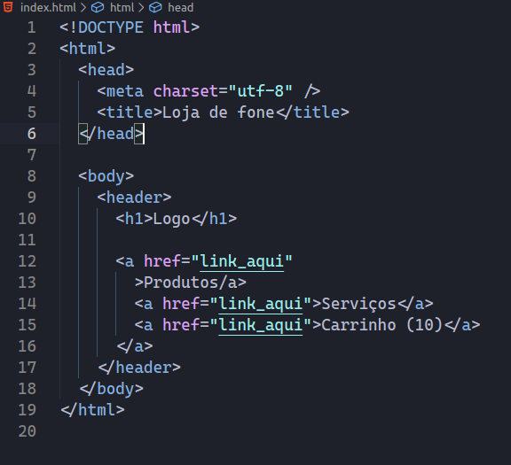

## Configs e dicas

### __Zeplin__

Ferramenta onde ficará os layouts do curso, incluindo assets e especificações dos elementos. --> [Zeplin](https://zeplin.io/). O zeplin não permite edição, apenas mostra as informações.

__Obs:__ O adobe XD consegue importar como projeto no Zeplin.

---

# Por onde começar? 
- Começar pelas seções do site, dividir o site em pequenas seções (grupos de conteúdo), é indicado começar pela seção que está no topo.
- 
# HTML 5

HTML é uma linguagem de marcação que tem as seguintes responsabilidades:
- Cuida de todo o __Conteúdo__ do site;
- Semântico -> utilizar as tags de forma correta;
- Cuida da parte de estrutura do site;
### Características:
- O alimento das coisas no Browser se dá da __esquerda__ para __direita__ e de __cima__ para __baixo__.
- Uso semelhante ao do plano cartesiano, onde o __eixo X indo para a direita é positivo/cresce__. Já __o eixo Y indo para baixo também é positivo/cresce__, o que diferencia para o plano cartesiano usada na matemática (onde o Y para baixo é negativo).
  


TAGS -- > tag de abertura -- nome da tag -- tag de fechamento __`< nome> </ nome>`__


> Títulos
|| Usado para quando queremos definir títulos, pode ir do `<h1>` ao `<h6>`
- ```html
  <h1></h1>
  ```
> Links 
|| Âncora... usada para linkar e definir a navegação do usuário. Se vocÊ tem um texto que você quer que o usuário clique nele e seja redirecionado você pode usar essa tag junto com o atributo `href`.

- ```html
  <a></a>
  ```
   ```html
  <a href="seu link aqui"> Clique aqui! </a>
  ```

> Meta
|| São tags responsáveis por transportar alguns dados para o navegador (metadados). Nesses dados estão descritos as informações relacionadas ao website.São responsáveis por informar sobre dados como uma descrição do conteúdo da página, seu autor, data de criação, entre outras informações. As meta tags são inseridas entre as tags de abertura e fechamento do elemento __Head__. Não existe tag de fechamento para a tag meta. 

- 
  ```html
  <meta name="description" content="texto aqui">
  ```
> Title
|| tag responsável por colocar o título na aba do navegador. Como o título é uma informação do site, deve ficar dentro da tag __head__
- ```html
  <title>Título do site aqui!</tittle>
  ```

> Body 
||  Local onde as tags que mostram informações para o usuário devem ficar.

- ```html
  <body></body>
  ``` 


> Head
|| local onde devem ficar as tags de configuração (`<meta>`)

- ```html
  <head></head>
  ```


> DOCTYPE
|| Responsável por informar qual é a versão do HTML que está sendo usada. Deve vir no inicio do html. 

- ```html
  <!DOCTYPE html>
  ```

> Nav 
|| Tag utilizada para navegação. Indica que haverá um espaço para navegação. 
- ```html
  <nav></nav>
  ```

> Header
|| Tag utilizada para montar o cabeçalho do site. 
- ```html
  <header></header>
  ```

__Exemplo de um html usual__
