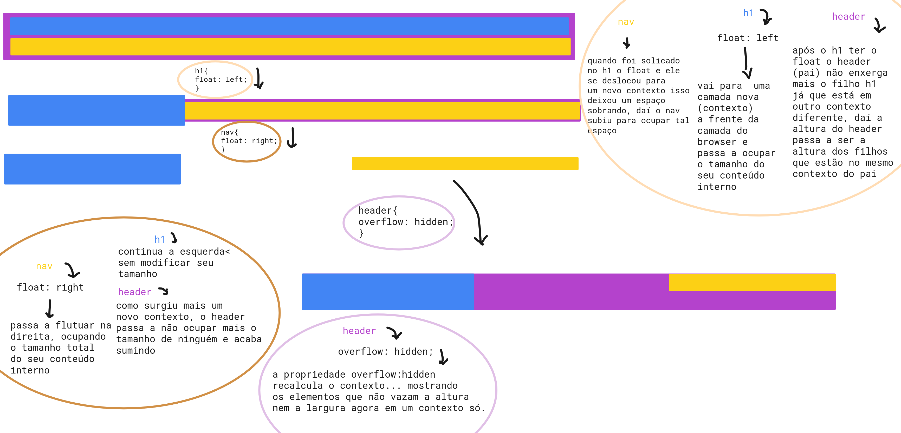
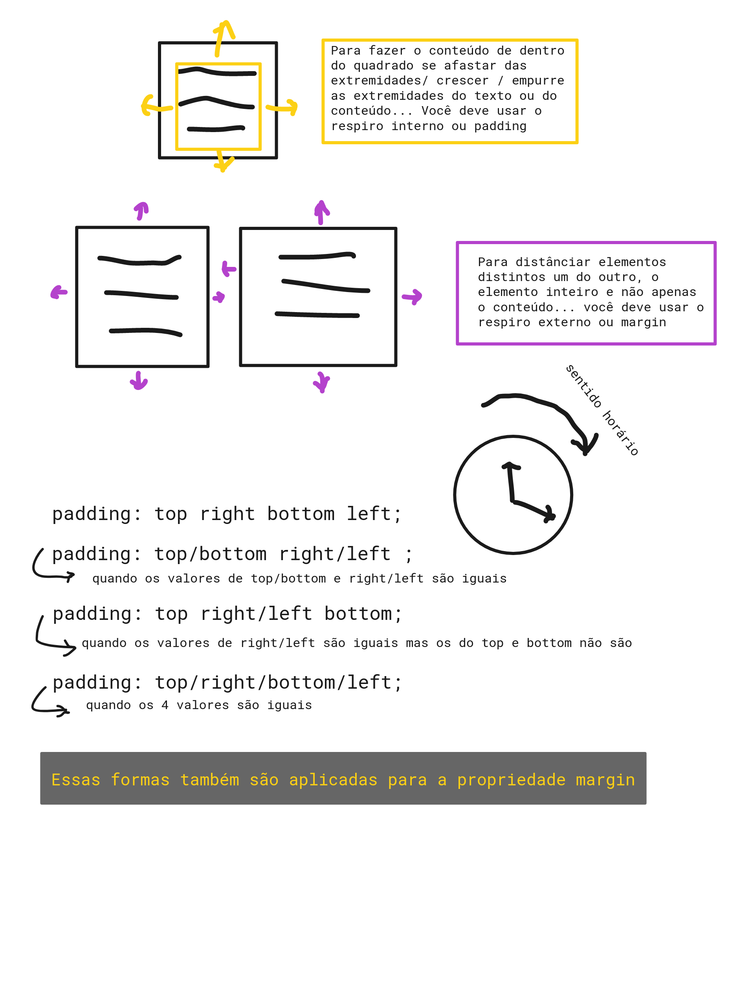

### __Dicas__ 

Atalho do VSCode para ir para uma linha especifica: 
```properties
ctrl + shift + p 
```
daí você deve escrever 
```
:nºDaLinha
```
---

Quando se tem um pai padrão pode se colocar as estilos iguais de elementos iguais nele ao invés de colocar em cada elemento. É porque assim os filhos herdam as especificações dos pais.

```html
<header>
  <h1>LOGO</h1>
  <nav>
    <a>link 1</a>
    <a>link 2</a>
    <a>link 3</a>
  </nav>
</header>
```

Seguindo o que foi mencionado acima se aplicassemos um estilo dentro do `<header>` ele deveria ser herdado para o `<h1>`, `<nav>` e `<a>`, mas na prática isso nao ocorre... O que for herdado só vai para o `<h1>` e `<nav>`. O que acontece é que o estilo da tag `<a>` tem uma __preferência de estilo setada pelo navegador__(`*|*:link rgb(0, 0, 238)`), que sobrescreve a herança do pai, por isso a tag `<a>` não ganha a herança do `<header>`.
Para fazer a tag `<a>` herdar os estilos do pai é preciso usar o __`inherit`__;

```css
header{
  color: #fff;
}
a {
  color: inherit;
}
```

---
## font-family é top!

```css
font-family: Arial, Helvetica, sans-serif;
```
__O que isso significa?__  
Se  o usuário não tiver Arial na máquina dele ele poderá usar a Helvetica, senão tiver a Helvetica poderá usar qualquer fonte sem serifa (`sans-serif`).

_O que é serifa?_  
São pequenos tracinhos nas extremidades das fontes, dá a sensação que a fonte é quadrada. (Letra de jornal impresso).


> Para trazer uma fonte de fora do seu browser basta pegar o link e adicionar no `<head>` assim como é feito o com os arquivos .css. __E esse link deve estar antes do arquivos .css__, uma vez que esses arquivos .css usarão essa fonte nova.
---
## Float de uma forma feliz :smile:

__Posicionamento de elementos na tela com CSS__

Comportamentos do float:
- Ao ser aplicado no elemento X esse elemento vai para frente, numa nova camada (novo contexto) que é criada a frente da antiga, diferente da camada que ele estava antes do float. Logo os outros elementos que estão na camada antiga ficam com espaço sobrando e acabam subindo para ocupar esse espaço. 
- __NUNCA o float esconderá um conteúdo (texto, parágrafo, etc)__
- O elemento antes de aplicar o float ocupava a inteiramente a largura do pai, depois de aplicado o float o tamanho dele passa a ser o tamanho do conteúdo dele. 
- __O elemento pai ignora a altura do elemento com a propriedade float__ e respeita a altura dos demais elementos. Isso ocorre devido ao novo contexto que foi criado, o pai dele passa a somente enxergar apenas o contexto do browser e não o do float; o pai não consegue ver o elemento fluatuando no novo contexto e admite que ele não está no contexto do browser. __Nesse caso é preciso dizer para o elemento pai considerar a altura do elemento com o float__ para fazer isso é preciso fazer com que o pai recalcule o contexto (para que assim ele passe a enxergar os filhos) para isso se usa a propriedade `overflow: hidden`
- a propriedade `overflow: hidden` é para esconder um elemento e deve ser aplicada no elemento pai. __Caso você defina uma altura ou largura menor/maior do que a do elemento  pai ele será escondido, _ou seja qualquer elemento que vaze o tamanho do pai é escondido_.__
  - o `overflow:hidden` recalcula o contexto pois não foi definido a altura nem a largura, daí ele vai procurar elementos em contextos diferentes, sempre respeitando as definições de largura e altura... como não há nenhum elemento vazando a altura nem a largura(não foi definido) não há nada para esconder e assim o contexto é recalculado e todos os elementos voltam a aparecer. 





## Respiros internos e externos

-> nem sempre trabalhar com pixel é o indicado, daí você pode trabalhar com os respiros. 

* Respiro para fora do elemento =  respiro externo = margin
* Respiro para dentro do elemento = respiro interno = padding

Quando usar o padding? Quando usar o margin?

