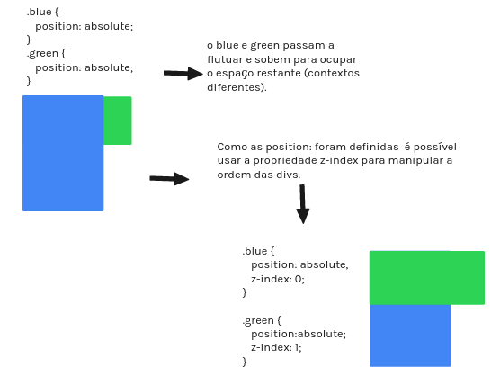

## Input

- Colocar um valor no sistema
- tag `<input>` 

## Função Calc()

- Essa função faz calculos matemáticos nos seletores. 
- Com ela é possivel somar pixel com % e etc.

## Position 
- Relative
- Static
- Fixed
- Absolute

### Position Absolute

-  O position absolute faz referência ao **elemento pai**. Logo, é possível movimentar a div com os atributos: `top`, `right`, `bottom` e `left`
-  Com o uso dessa propriedade com absolute é criado um novo contexto diferente do contexto do pai, assim o elemento que está em um contexto diferente subirá para ocupar o espaço que sobrou (ele só subirá se estiver em um contexto diferente do elemento com o position absolute)

### Position Relative
- O position relative faz referência a **ele mesmo**. Porém, é como se fosse aplicado um margin fazendo ele empurrar para a direção contrária
  - Ex: Se eu quiser deslocar o elemento para a direção da direita eu preciso dar um valor ao left, porque ele vai aplicar esse valor na sua própria região do left deslocando assim o elemento para a direita.

### Position Fixed
- Permanece fixo independente do que aconteça. 

## Z-index
- Manipula a ordem de aparição das divs

