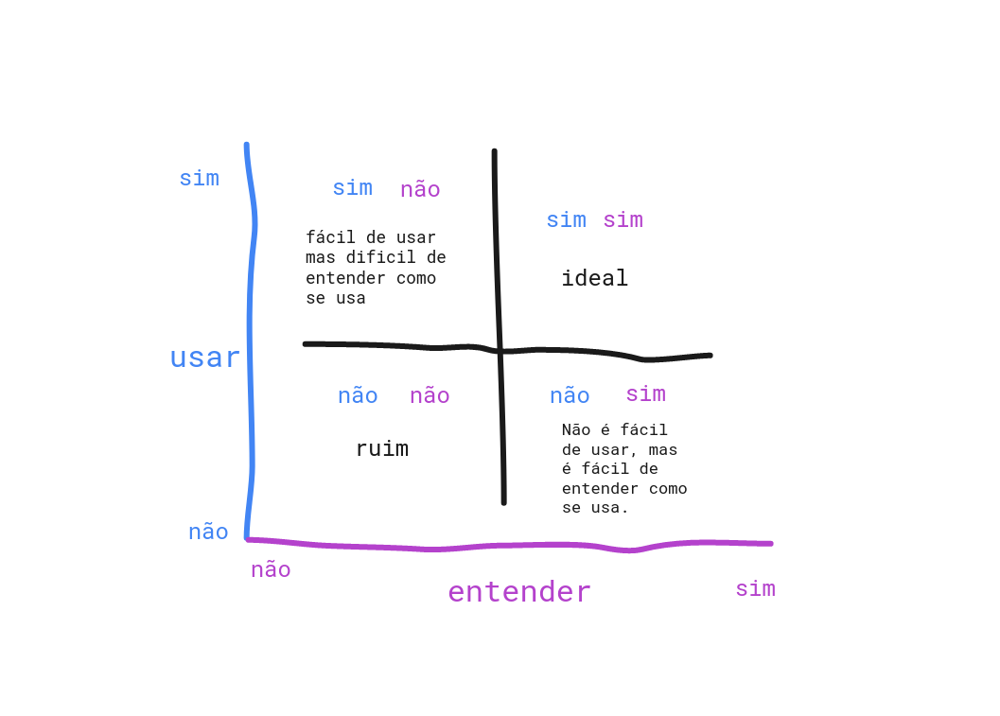

# Affordance 

- Usabilidade em UX (user experience)
- Analisar se é fácil de usar e se é intuitivo = bom affordance
  - exemplo de bom affordance é o menu hamburguer
- Muitas vezes o affordance depende dos seus usuários, faixa etária, quem é o seu usuário e etc. É preciso ter empatia e tentar entender se realmente é o melhor caminho, se vai ser bom para o usuário.
  
  

- Jakob Nielsen - 10 heurísticas de Nielsen
[Post sobre as 10 heurísticas escrito por Marco Bruno](https://blog.caelum.com.br/10-heuristicas-de-nielsen-uma-formula-pra-evitar-erros-basicos-de-usabilidade/)

--- 
# Pseudo-classes
- É chamada assim pois é criada uma nova classe que depois é removida após a ação acontecer. 
- `:hover`, `:focus`, `:active` e etc
---
## Transform
- Permite modificar o espaço coordenado do modelo de formatação CSS. Usando-a, elementos podem ser traduzidos, rotacionados, ter seu tamanho ajustado e inclinados de acordo com os valores definidos.
- Se a propriedade tem um valor diferente de none, um contexto de empilhamento será criado. Neste caso, o objeto atuará como um bloco recipiente para  position: fixed para os elementos que estão contidos.
  
## Transition
- Controla as transições (tipos, tempo, velocidade e etc)
- Ela permite definir a transição entre dois estados de um elemento. Estados diferentes podem ser definidos usando pseudo-classes tais como `:hover` ou `:active`; ou dinamicamente, usando javascript.