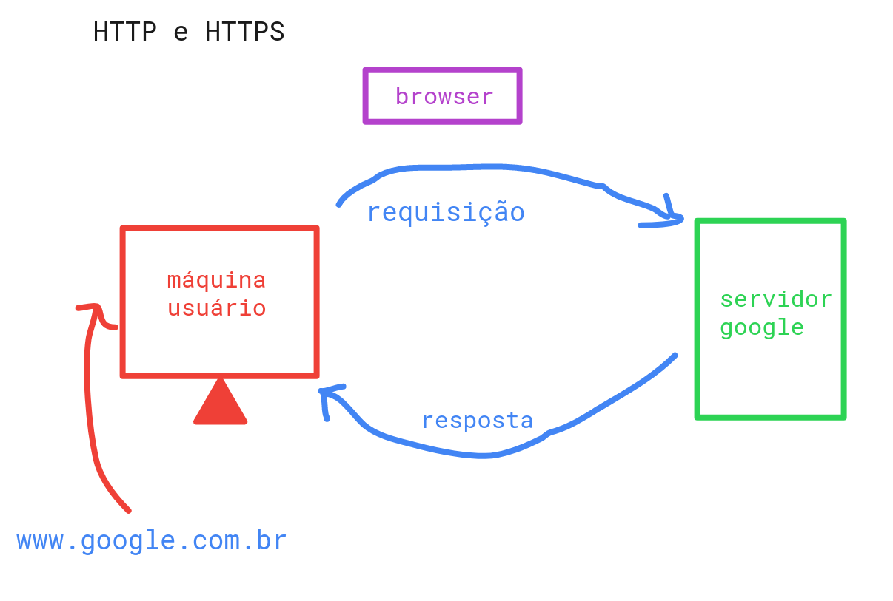
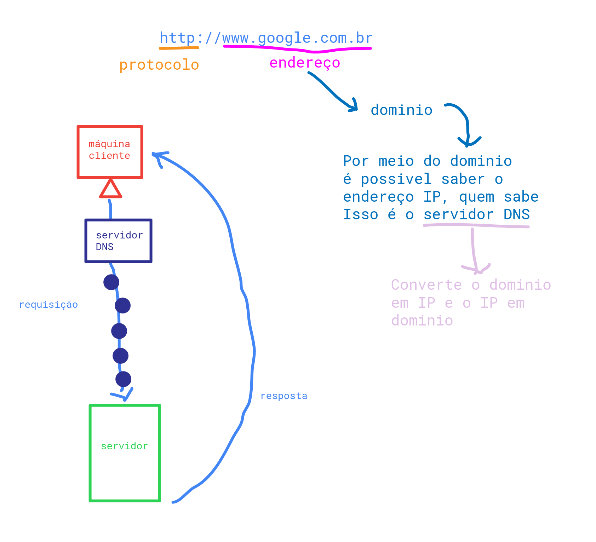
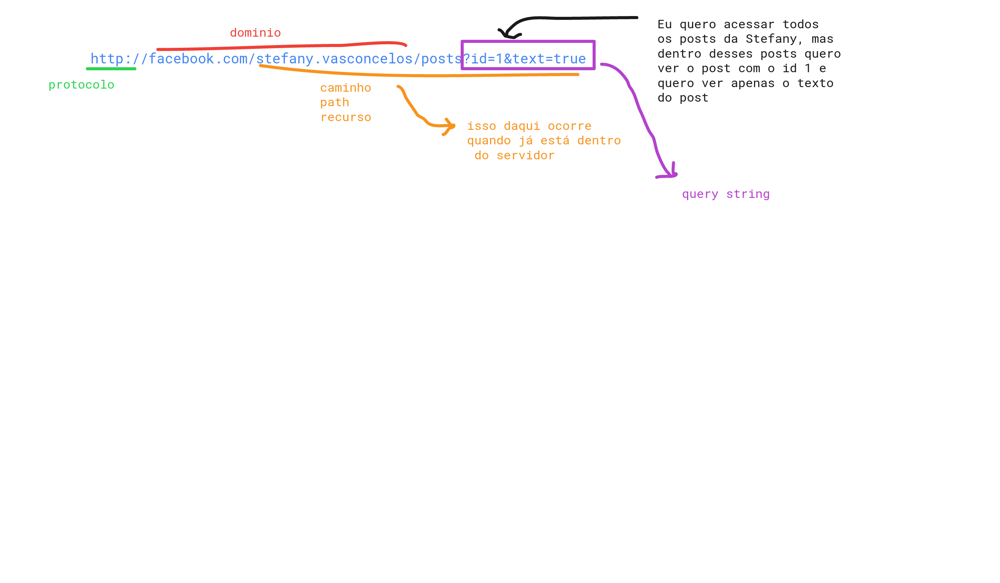
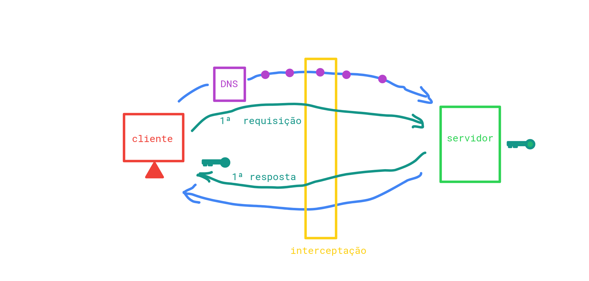

# HTTP e HTTPS
- Protocolos bastante usados
- Protocolo é a forma como a gente se comunica, como trocamos informação.
  - No sentido de web é necessário um protocolo pra trocar informação com o cliente(máquina do usuário) e o servidor. 

- O protocolo HTTP é ótimo com textos, quando se faz um requisição geralmente se espera um texto como resposta.

 

- Ao se fazer uma requisição ao servidor primeiro se para no servidor DNS
  - O servidor DNS sabe o caminho certo para chegar até o servidor
  - Até chegar no servidor ele para em 5 máquinas.
  


- Tudo que vem depois da barra é chamado de path, recurso ou caminho. Quando você acessa algo do path você já está dentro do servidor. 
  - Dentro do path ainda se pode acessar recursos especificos (como por exemplo filtros e etc.)
  

  ### HTTPS
  - Procotolo seguro
  - É possível que alguma pessoa intercepte sua requisição no meio do caminho (entre a requisição, que é a ida até o servidor, ou na resposta, que é a volta)caso o protocolo seja o http
  - No https o seu dado quando sai da sua máquina ele sai criptografado. 
    - Na primeira requisição ele não envia de cara os dados, ao descobrir que se trata de um https ele pede uma chave para gerar a criptografia. E como resposta do servidor é recebido a chave (chave pública), essa chave gera os dados criptografados mas não consegue descriptografar os dados. O servidor também possui uma chave, essa chave tem o poder de descriptografar.
  

# HTTP na vida real

- HTTP server 
  - Para atualizar as mundaças é preciso atualizar, não tem reload automático.


 >  para instalar 
  ```properties
  sudo npm i http-server -g
  ```

  > para rodar o servidor
  ```properties
  http-server
  ```