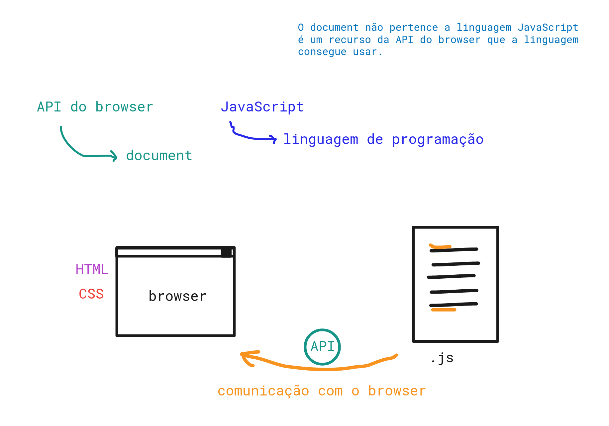

# HTML, CSS e JavaScript


## HTML
- Cuida do conteúdo de forma semântica na tela.
  - Se faz isso usando as tags
- Estrutura ( apartir do **HTML 5** cuida da estrutura da página)

## CSS
- Cuida da parte visual
- Com o **CSS 3** temos a parte de animação

## JavaScript
- Cuida do comportamento da página
- Cuida da interação com o usuário.

```javascript
window.document.querySelector(".-heart");
```

pegando o html dentro da janela e buscando dentro do html o coração (mesmo seletor de classe usado no css)

- É preciso carregar o javascript no HTML, para isso se usa a tag `<script>` com o `src` para o arquivo .js
-  essa tag `<script>` pode ficar em dois locais dentro do html, **dentro da tag `head` ou da tag `body`.** 
-  O problema do `<script>` ficar dentro da tag `head` é que ainda não deu tempo do css e html ser carregado por completo, por isso o `<script>` .js muitas vezes não funciona.
-  **É aconselhavel colocar os `<script>`
na parte inferior do html (ainda dentro do `body`)**, pois os outros arquivos do html devem ser carregados primeiro que o javascript. 
- Ter cuidado que o HTML é blocante, ele bloqueia.
  
###  Variável com JavaScript
- Utilizado para guardar algo. 
- Toda variável que guarda uma referência do html (tag e etc) colocasse um prefixo que é o `$`
- Várias formas: `const`

```javascript
const $heart = window.document.querySelector(".-heart");
```
Entrando dentro do windows, do window tá entrando dentro do document, do document estamos procurando pelo coração. 

- O `alert()` mostra uma informação na tela, em formato de popup

### JavaScript e API do Browser

 

 ### AddEventListener
 - Adicionando um ouvinte de um evento.
   - Evento é qualquer coisa que o usuário faz na tela (clicar, arrastar e etc)
  
  ```javascript
  $heart.addEventListener("click", handleClick);

  function handleClick() {
    console.log("ae");
  }

  ```
adicionando o evento clique, e criando uma função para lidar com o clique. 

handleCLick é uma função responsável por lidar com o clique, mas para ela ser executada é preciso chamá-la (`handleClick()`)


- Quando se coloca o parenteses () o browser executa no mesmo momento, se você quiser que seja executado depois (de acordo com o evento, ou quando o evento ocorrer) você deve tirar os parenteses. 
