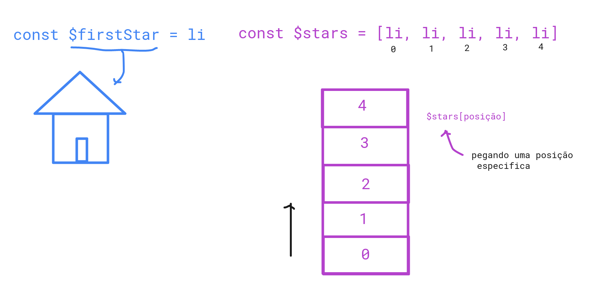

## Tags HTML

### ol 
- lista ordenada
  
### li
- item da lista


## JavaScript

### querySelector
- retorna apenas a primeira ocorrência

### querySelectorAll
- retorna todas as ocorrências

### Listas

- Pense em moradias 

  

- Como percorrer uma lista?? 
  
   ```javascript
   $stars.forEach()
   ```

  ` .forEach() `nos permite percorrer uma lista. Pode passar uma função


  ### Função anônima 
  - função sem nome
  ```javascript

   $stars.forEach( function ($star, key){
     $star.addEventListener(' click', handleStar)
   })

   function handleStar(){
     this.classList.toggle("-active)
   }
  ```

  - dentro da function é retornada uma variável (`$star`), nessa função também é devolvida a posição de cada estrela (`index ou key`)
  - vai sendo adicionado no `.addEventListener` cada estrela
  - A função `handleStar` só será criada quando houver o click
  - `this` = este, o `this` é dinâmico. No caso o `this` é qualquer estrtela que foi clicada na questão, ela muda de acordo com o clique na posição da estrela. O this é modificado conforme o elemento que você tá clicando