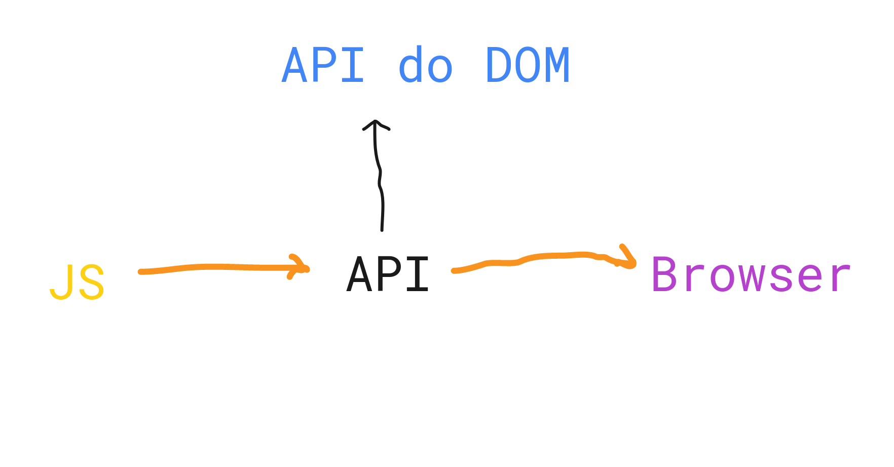

# JavaScript

- Linguagem de programação
  

# API do DOM

- **Document** Object Model
  - Quando usamos a palavra *document* estamos usando a API.
 
- Com a linguagem (JS) você precisa acessar um recurso de detro do browser.

**O JS é algo a parte da API do DOM, são coisas diferentes**

