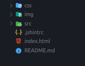
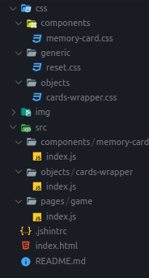

## IF ternário

- verifca e já retorna um valor, uma forma diferente de fazer um if sem ter chaves
 - O que vier depois da `?` siginifca que é verdade e terá os comandos a serem executados caso sejá verdade e o que vier depois dos `:` é para checar o falso e se for falso tem o comando a ser feito   
 - A sintaxe é: `[ condição a testar ] ? [ resposta se verdadeiro ] : [ resposta se não verdadeiro ]`

```javascript
var variavel = condicao ? valorSeTrue : valorSeFalse;
```

- Uma diferença fundamental em relação ao if é que o ternário* é um operador, e não um statement. Ele sempre resulta em um valor, que é retornado, como se vê no exemplo. Não tem como inicializar uma variável em uma linha com if justamente porque ele não gera valor nenhum. 
- Por isso o operador condicional ternário costuma ser mais utilizado para atribuição de valor a uma variável, enquanto o if comum é mais usado para controle de fluxo.

- A vantagem do ternário para atribuição de valor é clara: não é preciso repetir o nome da variável. Por exemplo, nesta atribuição com if usamos 6 linhas (incluindo a declaração da variável)


---

# Revendo o projeto

O que foi feito até agora? 

Pra quê serve cada parte e quais suas responsabilidades?


 

 - Tudo começa pelo **index.html**, que é lido pelo browser e depois le as tags links, que contem outros arquivos

 

 - a pasta **generic**, cuida dos comportamentos de reset, onde se tira o comportamento padrão do browser para não interferir na montagem do layout do projeto.
 - a pasta **objects**, guarda componentes que cuidam da estrutura ou componentes muito simples. 
   - Na pasta objects atualmente só conta com o *cards-wrapper.css* que é um componente de estrutura(só cuida de comportamentos ligados a estrutura) (wrap é de envolver)
 - a pasta **components**, é ínico e reutilizável(estamos usando um componente só para gerar dois tipos de cards diferentes)


- Há apenas uma tag no `body`, todas as tags estão sendo geradas via JavaScript
  

- Os arquivos `.js` ficam dentro da pasta **src**. 
  - na pasta **objects** tem outra pasta chamada **cards wrapper**
    - na pasta **objects** temos objetos que cuidam da estrutura
    - na pasta **cards wrapper** temos o arquivo `index.js` que cuida da criação do `section` que envolve os cards e de também cuida em adicionar a classe nessa `section`, para que assim o css seja aplicado
  - na pasta **components** tem outra pasta chamada **memory cards**
    - os componentes não devem trabalhar com dados, nem saber de dados eles devem ser stateless
    - na pasta **components** temos a criação de cada component do site
    - na pasta **memory cards** temos a criação dos dois tipos de cards, além de uma função especifica para o click no card *(uma função que retorna nosso html em formato de string)
  - na pasta **page** tem outra pasta chamada **game**
    - a pasta **page** tem a responsabilidade de usar os componentes e expor as coisas na tela
    - na pasta **game** tem um arquivo `index.html` que é onde a gente começa a criar os elementos na tela