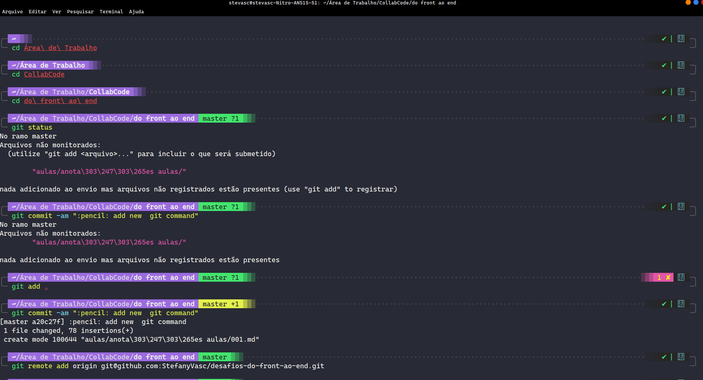

# Desafio 001

1. Fácil
2. Médio 
3. Difícil

## 1. Fácil
> Mudar o tema do terminal e adicione um print do terminal.

Tema terminal: [Drácula](https://draculatheme.com/)

Tema ZSH: [powerlevel10k](https://github.com/romkatv/powerlevel10k)

## 2. Médio
> Use outros comandos do Markdown diferentes dos que foram apresentados na aula. 

DE

