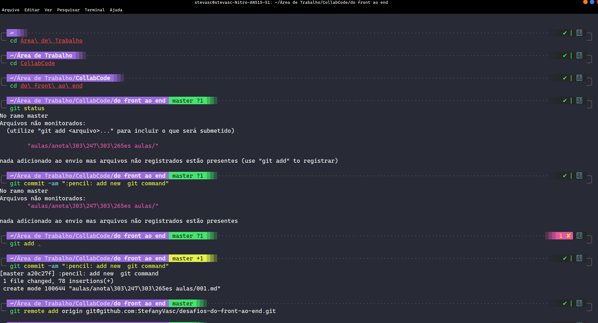

# Desafio 001

1. Fácil
2. Médio 
3. Difícil


## 1. Fácil
> Mudar o tema do terminal e adicione um print do terminal.



Tema terminal: [Drácula](https://draculatheme.com/)

Tema ZSH: [powerlevel10k](https://github.com/romkatv/powerlevel10k)

## 2. Médio
> Use outros tipos de marcação de doc Markdown diferentes das que foram apresentados na aula. 

na construção dos markdown foram utilizadas as seguintes marcações

| Marcação             | Descrição         |
| -------------------- | ----------------- |
| 1.2.3.               | Lista ordenada    |
| [nome](url)          | Link externo      |
|        | Add imagem local  |
| ##                   | Título secundário |
| _texto_              | Itálico           |
| __texto__            | Negrito           |
| `texto`              | Código simples    |
| ``` bloco codigo ``` | Bloco de Código   |
| >                    | Citação           |


