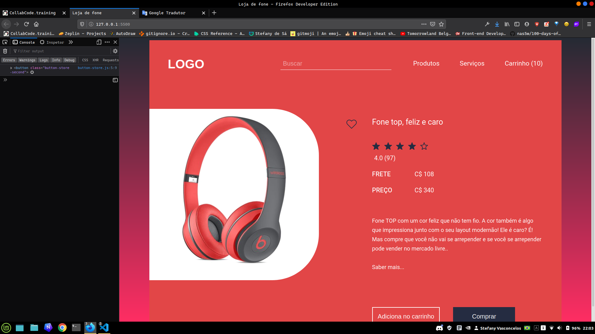
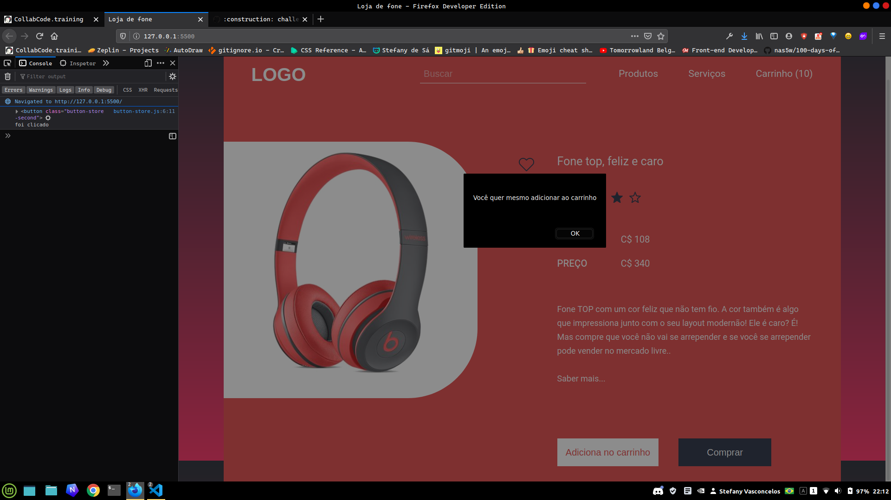
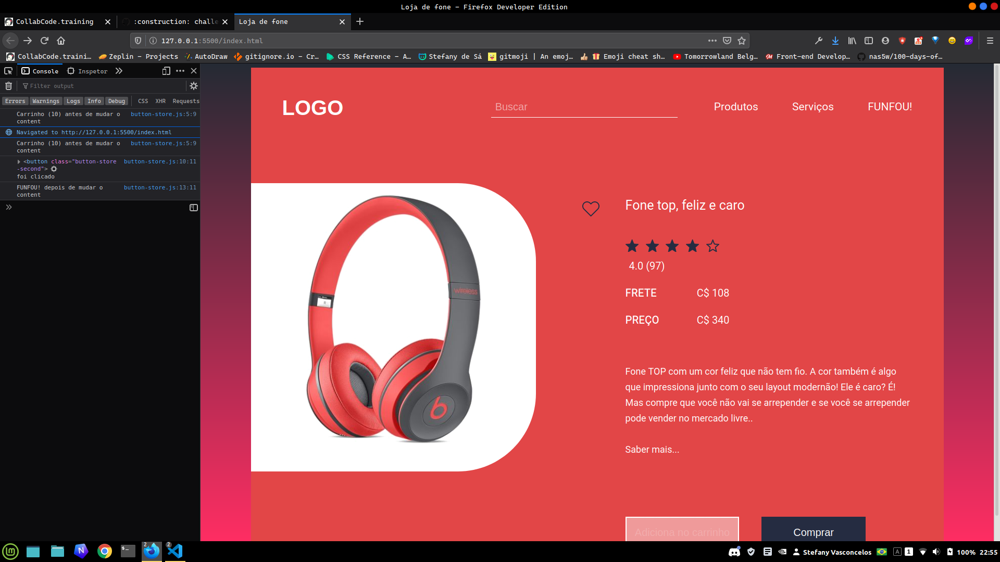

# Desafio 013 :books:

1. Básico
2. Intermediário 
3. Avançado

## 1. Básico :ballot_box_with_check:
> Conseguir pegar o elemento "adicionar no carrinho" e jogar no console. 

 

:memo: [Link do repositório aqui](https://github.com/StefanyVasc/loja-fone/commit/c9e5aaca809760746a2093973967720910ada535)

## 2. Intermediário :ballot_box_with_check:
> Quando clicar no botão "adiciona no carrinho" deve aparecer uma mensagem de texto.

 

:memo: [Link do repositório aqui](https://github.com/StefanyVasc/loja-fone/commit/0ddf86c886cbcd5fbe2ecca850efaa450368b2f9)

## 3. Avançado :ballot_box_with_check:
> Quando clicar no botão "adicionar no carrinho" contabilize no header os cliques ou mudar apenas o texto do carrinho. 
 

:memo: [Link do repositório aqui](https://github.com/StefanyVasc/loja-fone/commit/6300fe774f07836c6d102f0ca330fbcfb2870aaa)

