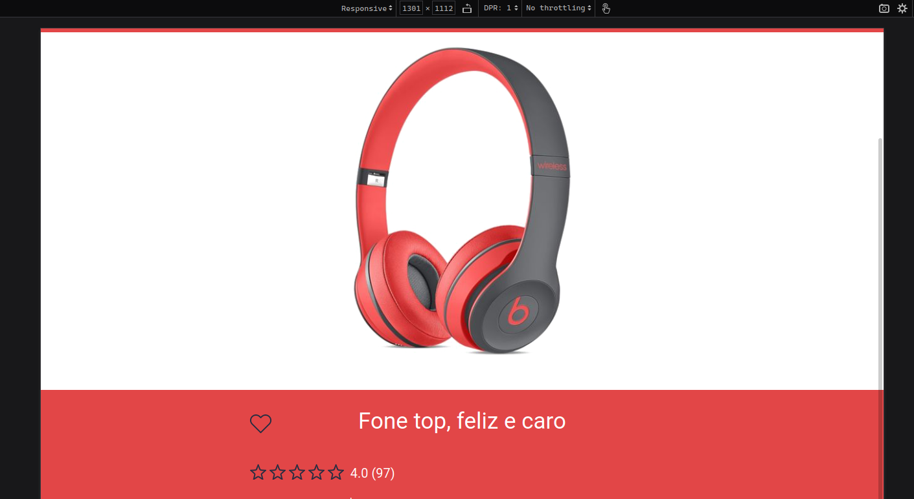
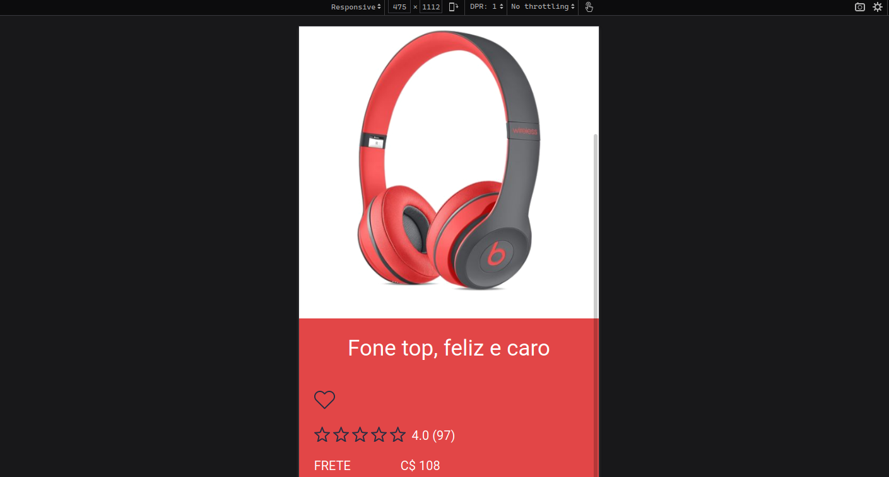

# Desafio 016 :books:

1. Único
   
## 1. Único :ballot_box_with_check:
> Em determinado tamanho de tela o coração some, você deve posicionar o coração à esquerda do título ou em algum lugar de sua preferência. 

:memo: [Link do repositório aqui](https://github.com/StefanyVasc/loja-fone/commit/b1060b0b22e25610f1b338b7b53644608cf42f58)

- **Breakpoint 1**:  1310px quando a imagem do fone passa a ocupar a horizontal inteira. 
  
  

- **Breakpoint 2**:  475px, versão mobile. 

  

