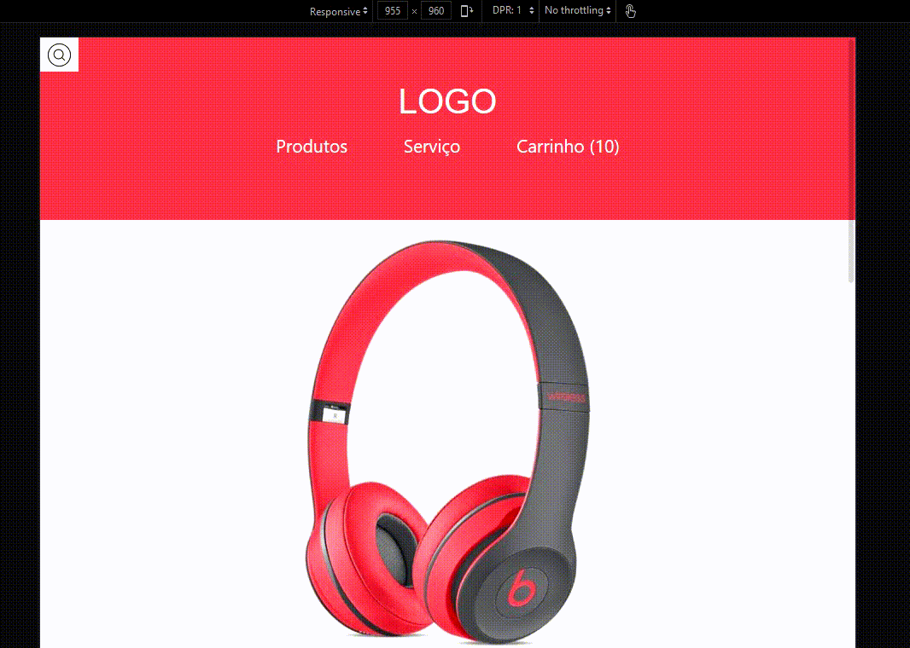

# Desafio 017 :books:

1. Básico
2. Intermediário
3. Avançado

## 1. Básico :ballot_box_with_check:

> Pôr o ícone da busca. A imagem está no iconfinder

:memo: [Link do repositório aqui](https://github.com/StefanyVasc/loja-fone/commit/d7a98ac37d52fdcf3056da388f9687d0eabbcd99)

## 2. Intermediário :ballot_box_with_check:

> Fazer o click só funcionar encima da lupa

:memo: [Link do repositório aqui](https://github.com/StefanyVasc/loja-fone/commit/f64ac8a7ff9524396f3d6e56754f3d27303d9b46)

- campo de busca encolhido antes do clique
  

- campo de busca expandido depois do clique.
  

## 3. Avançado :ballot_box_with_check:

> Trocar a lupa por um ícone de X (quando estiver aberto/ativado)

:memo: [Link do repositório aqui](https://github.com/StefanyVasc/loja-fone/commit/f222d84059ee5ccca35979209a40de3e6f0252bd)

